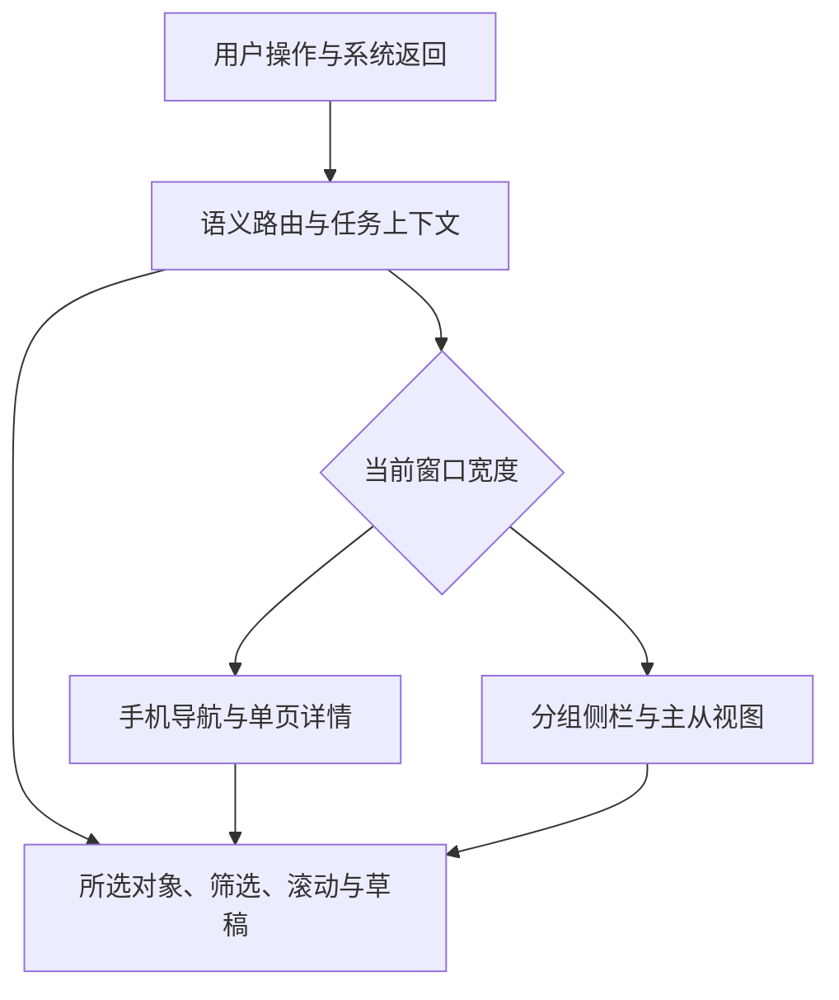
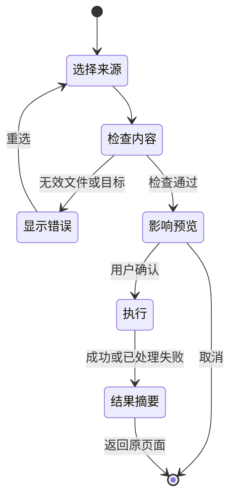

# API24+ 视觉与交互规格提案

日期：2026-10-02。配套：[优化调研](UI_UX_RESEARCH_2026-10-02.md) · [证据索引](UI_UX_EVIDENCE_2026-10-02.md)。

本文件是下一轮实施规格，不是已完成的 UI。API 最低版本保持 6.1.1(24)，目标 SDK 26.0.0。下面的布局数值、性能预算和交互取舍是项目建议；官方 API 的起始版本和限制另行标明。

## 1. 材质能力必须分成两条路径

| 路径 | 官方起始版本 | 可采用的能力 | 本项目使用策略 |
|---|---|---|---|
| UIDesignKit / HDS | 6.1.0(23) | `HdsNavigation` 标题栏按钮、`HdsTabs` 悬浮底栏的 `systemMaterialEffect` | API24 可进入这一分支；默认 `MaterialType.ADAPTIVE` + `MaterialLevel.ADAPTIVE`；定制前查询 `hdsMaterial.getSystemMaterialTypes()` |
| ArkUI / uiMaterial | 26.0.0 | `ImmersiveMaterial`、组件/专属材质接口、受支持弹窗与选择控件、空间动效 | 仅运行时确认 API26 后使用；同时核对设备支持、应用配置和组件所在场景 |
| 通用表面回退 | 当前 API24 工程已有能力 | 主题资源色、单层 `backgroundBlurStyle` 或 `backgroundEffect`、轻阴影 | 提供完整可读 UI；透明度减少或效果关闭时可切实体表面 |

以上由官方 HDS 指南和 SDK 声明交叉核对，详见 [E13](UI_UX_EVIDENCE_2026-10-02.md#e13)。**HDS23 可用不等于 ArkUI26 可调用，也不等于任意 API24 设备都有相同折射/高光强度。**

### 1.1 API26 的判断顺序

1. 判断运行时 API26 能力；低版本不得构造 API26 对象、访问其静态成员或调用方法。已有 `GuardedMaterialModifier` 保护了方法调用，应保留其意义。
2. 使用 `uiMaterial.isImmersiveMaterialSupported()` 判断设备是否支持；`getGlobalMaterialLevel()` 读取设备材质等级。等级由系统决定，不提供“强制把 ArkUI 调为高算力”的设置。
3. `getMaterialInfo()` 读取的是应用材质配置，**不是设备渲染成功的证明**。`MaterialState.ENABLE` 也不代表一个放错位置的组件会显示效果。
4. 检查组件类型和位置；受限位置不应选择沉浸光感路径。
5. 应用用户的效果/透明度/动态背景偏好，再决定最终表面。准备明确底色，不能以“对象非空”作为移除一切可读底色的依据。

HDS 路径有独立的能力查询和枚举，不能复用 ArkUI 的数字值；HDS 的自适应材质等级和 ArkUI 的 `ImmersiveStyle` 厚薄也不是同一个设置。

### 1.2 适用位置与当前风险

华为当前指南对 API26 的生效场景有限制：指定对话框、菜单、Popup/半模态等接口以及 Slider/Toggle/Select 可在页面内使用；其余组件依赖 `Navigation/NavDestination` 标题栏或横向底部 TabBar。准确清单随 SDK/文档维护，以 [E13](UI_UX_EVIDENCE_2026-10-02.md#e13) 链接为准。

| 当前实现 | 发现 | 拟调整 |
|---|---|---|
| `Index.sideNav()` 的普通 `Scroll` | 在标题栏/底部 TabBar 场景之外设置 API26 材质；又因对象非空关闭普通模糊并用透明底 | 侧栏保留稳定表面/受控普通模糊；将光感集中于真实导航标题/底栏，不把整个侧栏假装成标题栏 |
| `phoneShell()` 的 HDS 底栏 | 把 HDS 的 `systemMaterialEffect` 错绑到 ArkUI26 可用标记 | 拆开 HDS 能力策略，API24 也可走经验证的 HDS 自适应路径 |
| `SettingPage.ambientChip()` | 关闭/标准/增强写偏好，`Index` 材质对象独立初始化，且偏好主要在出现时读取 | 统一可观察的视觉设置，页面内立即更新；关闭包括已开启的组件默认效果 |
| `RiskVerifyModal` 自绘浮层 | 视觉上像弹窗，不证明它属于系统允许的 CustomDialog/半模态上下文 | 保留验证 Promise 生命周期，评估迁移原生模态承载；迁移前使用可靠主题表面 |
| `PressCard`、背景壁纸 | 卡片模糊与全屏壁纸模糊可能同时存在 | 建立表面角色和渲染预算，清楚决定哪一层采样背景 |

这是源码与官方规则的推断，不是本轮设备复现结果。材质生效资格应在调试记录中检查，最终还需截图与实际设备观察。

### 1.3 开关语义

建议用户选项为“自动”“减少效果”“关闭材质效果”，动态背景单独开关。自动跟随系统能力；减少效果保留层次和轻反馈；关闭使用明确表面色，不保留隐藏的额外模糊动画。不要把“增强”解释成所有设备都能得到同一种折射效果。

API26 中，`systemMaterial(undefined)` 的语义不是关闭默认光感；需要关闭默认开启组件时使用 `uiMaterial.Material.empty`，且这次访问本身仍需 API26 保护。HDS 使用自己的 `MaterialType.NONE` 等配置表达关闭，不能互换。[E13](UI_UX_EVIDENCE_2026-10-02.md#e13)

材质反馈以轻微形变为主。仓库 `PressCard` 注释保留了“点击不发光”的既有设计记录，本提案默认不新增点光源闪光；API26 可用 `lightEffect: null` 明确关闭该类反馈。用户今后明确改变偏好时再单独评估。

## 2. 视觉层级与渲染预算

| 表面角色 | 内容 | 默认外观 | 回退 |
|---|---|---|---|
| 背景 | 壁纸、主题底色、可选视频 | 一份背景源与主题遮罩 | 实体主题底色或静态封面 |
| 普通内容 | 统计、列表、说明、表单 | 稳定高可读表面；轻描边/阴影表达分组 | 实体表面，无布局变化 |
| 导航交互 | 标题、底部页签、少量合法位置操作 | 系统自适应材质，选中态清晰 | 单层普通模糊或实体底色 |
| 临时任务 | 菜单、筛选、确认、进度 | 原生弹窗/半模态层次与材质 | 原生默认表面 |
| 强调 | 主按钮、错误、选中、游戏品质 | 语义色配文字/图标 | 不依赖透明度和动画识别 |

遵循官方功耗指导：避免材质嵌套，避免同一表面同时使用沉浸材质与普通模糊，控制面积，不把持续光感覆盖在持续变化的视频背景上。本项目进一步建议：

- 主内容默认不使用实时沉浸光感；只在导航和短时任务层用有限面积效果。
- 视频模式优先使用稳定表面；必要时导航所采样的背景改为静态封面。若无法隔离动态采样，暂停视频或降低表面效果，不同时强开两者。
- 后台、不可见、减少动态效果状态下暂停视频；已有前后台暂停逻辑保留，补上节能/减少动态效果联动的设备验证。
- 长列表只对可见数据构建 UI；成就页已有 `List + LazyForEach` 不回退成全量 `Scroll + ForEach`。祈愿历史要检查外层滚动对虚拟化视口的影响。
- 保留不透明窗口基底；半透明颜色使用 ArkUI 的 `#AARRGGBB` 语义。不要重新引入大面积渐变来掩盖背景/主题错误。

## 3. 与 Windows 相似的布局规格

### 3.1 壳层与内容断点

沿用项目已有测量对象和断点，先修复语义路由，不为了“统一数字”把窗口宽与内容宽混用。

| 条件 | 壳层 | 内容策略 |
|---|---|---|
| 窗口 <720vp | 手机底部导航 | 列表→详情；次要命令收进菜单；确保最后一项能滚动到悬浮底栏上方 |
| 窗口 ≥720vp | Windows 风格分组侧栏 | 侧栏折叠由可用宽度及用户偏好共同决定，宽度轻微变化不覆盖手动选择 |
| 页面内容 <840vp | 壳层可仍为宽屏 | 主体单列，详情使用导航状态，不硬塞双栏 |
| 页面内容 ≥840vp | 宽屏页面 | 列表—详情或期数—详情；命令栏稳定可见 |
| 页面内容 ≥1200vp | 超宽内容 | 扩展卡片列数，文本阅读区保持合理最大宽；不把所有表单拉满 |

窗口缩放只能改变布局，不改变当前业务页面。建议的状态关系：

壳层迁移可采用 Navigation/NavDestination 承载，但第一步是定义路由与返回协议；不应一次把所有 `router`、V1 状态和业务 ViewModel 全量重写。过渡期间需要单一导航适配层，避免两套返回栈争抢。

### 3.2 页面骨架

| 层次 | 宽屏 | 窄屏 |
|---|---|---|
| 页面头 | 标题、账号/UID/存档/计划上下文、主命令 | 标题+主要上下文；主命令与更多菜单 |
| 页签/筛选 | 业务页签；搜索/筛选；结果数 | 可横向页签；搜索；筛选按钮和选中摘要 |
| 内容 | 概览或主从布局 | 列表或详情一次聚焦一个任务 |
| 状态 | 局部状态栏、最近更新时间、错误恢复 | 同样信息，不靠短暂 Toast 替代 |
| 临时任务 | 有合理最大宽的弹窗/侧面编辑 | 半模态或独立编辑页；键盘出现后仍能提交/取消 |

普通数据卡保留 Windows 的矩形分组和密度；导航/临时浮层可使用更圆润的鸿蒙外观，避免所有表格行都变成大胶囊。

### 3.3 尺寸与字体建议

以下是起始设计值，需结合系统组件默认值、大字和真机调整，不宣称为华为官方强制尺寸。

| 项目 | 建议 |
|---|---|
| 间距 | 使用 4/8/12/16/24vp 等少量层级；普通页面边距 16vp，宽屏可 24vp |
| 侧栏 | 现有展开 208vp、折叠 52vp 可先保留；与 Windows 205/45 的结构相似性已足够 |
| 列表侧栏 | 从约 280–320vp 起调，受实际内容宽约束，不在窄屏硬保留 |
| 数据卡圆角 | 普通内容约 8–12vp；触控大卡约 12–16vp；系统弹窗优先原生默认 |
| 字体 | 正文 15–16fp、辅助 13–14fp、页面标题 24–28fp；避免大量 10–11fp 有意义文本 |
| 数字 | 核心统计有明确单位和说明；日期/UID可复制；长 UID 不挤压主命令 |
| 点击目标 | 触控默认目标至少 44×44vp；密集视觉按钮可保持小外形但提供足够响应区 |
| 首页卡高 | 普通字号可保持当前 204vp 基线；大字/长内容改最小高度，不裁掉关键操作 |
| 阅读区 | 长篇公告、帮助和表单设最大宽，避免超宽窗口一行过长 |

## 4. 色彩、图标和可访问性

### 4.1 资源色的静态检查

下表按 sRGB 相对亮度公式计算，不包含壁纸混合与真实字体渲染；因此只能证明这些纯色组合的结果。数据来源是当前仓库的 base/dark 资源，复算方式见 [E11](UI_UX_EVIDENCE_2026-10-02.md#e11)。

| 前景 / 背景 | 对比度（显示四舍五入） | 含义 |
|---|---:|---|
| 白色 / 浅色主色 `#FF6B35` | 2.84:1 | 目前白字主按钮的普通文字需要调整 |
| 白色 / 深色主色 `#FF7A45` | 2.59:1 | 深色主题换了主色也不自动解决白字按钮可读性 |
| 辅助字 `#8A8A90` / 白色 | 3.43:1 | 不适合把正常字号的必要说明全部用此组合 |
| 辅助字 `#8A8A90` / `#F5F5F6` | 3.15:1 | 页面底色上的辅助信息更弱 |
| 深色辅助字 `#A9A9AF` / `#1E1E23` | 7.10:1 | 此实体表面组合较清晰，不代表任意透明背景都达标 |

采用 W3C 普通文字 4.5:1 作为项目验收目标，大文字及图形目标分别核查，不把 Web 的 CSS 尺寸直接换算成 ArkUI fp/vp。实际比较使用未舍入值。透明材质还需要最亮/最暗/高频细节壁纸的渲染检查。

建议拆开 `accent_fill`、`on_accent`、`accent_text`、`text_secondary`、`surface_content`、`surface_navigation`、`focus_ring`、`status_error` 等角色，而不是一个橙色同时承担按钮填充、链接与小字。主题资源成对维护。品质/元素色用于分类，需同时保留星级、元素名、图标或文本。

系统行为采用经 SDK 验证的 Symbol/矢量图标；游戏与导航识别保留原有彩色素材。替换设置齿轮等 emoji，避免不同字体下尺寸、颜色和基线飘移。不要给游戏图片套自动反色。

### 4.2 无障碍与键鼠

源码扫描在 `entry/src/main/ets` 中发现 224 处 `.onClick(`，显式 `.accessibilityText(`、`.focusable(`、`.keyboardShortcut(` 均为 0；这不等于原生 Button 无默认可访问性，但说明自绘控件需要系统走查。

- 可点击 Row/Text/Stack 改为语义正确的控件，或补名称、角色、选中/禁用状态和焦点行为。
- 图标按钮朗读“返回”“刷新祈愿”等动作；进度变化适度播报，倒计时不每秒打断读屏。
- Tab 顺序遵循页面头→筛选→列表→详情；弹窗打开后焦点进入，关闭后回到触发点。
- Escape 关闭最上层可取消弹层；Enter/Space 激活控件；本地快捷键不冒充跨应用全局热键。
- Windows 风格右键菜单对应触控的“更多”或长按，但任何关键命令不能只靠长按/悬停发现。
- 测试 100%、130%、160%、200% 字体；点击目标、按钮文字、首页固定卡高、双栏分割和键盘遮挡都要检查。

## 5. 动效规范

保留 `Motion.ets` 为统一入口，减少散落的不同弹簧。以下时间是项目建议，不是本轮实测。

| 场景 | 建议动效 | 边界 |
|---|---|---|
| 按压 | 约 80–120ms 的轻反馈，回弹约 180–260ms | 只影响可交互表面；整张含多个命令的数据卡不一起大幅缩放 |
| 同级页签 | 指示条移动/轻淡入，约 160–220ms | 不应产生“又进入一层页面”的强纵向位移 |
| 列表→详情 | 共享图像或容器过渡；其他内容淡入 | 返回对象和位置稳定；共享过渡失败可直接切换 |
| 模态任务 | 原生弹窗/半模态动效 | 不再叠加 PageContainer 的整页进场 |
| 数据刷新 | 数字轻更新、局部进度 | 不让整屏卡片重新 stagger；不制造假百分比 |
| 首次首页 | 少量内容分组轻进场 | 不对长列表所有项延迟，不卡住首次可操作时刻 |

提供减少动态效果策略：禁用大幅位移、弹性过冲、自动视频和长错峰；保留即时选中/加载/错误反馈。系统偏好的读取接口需在实施时按目标 SDK 核对；本提案不编造一个尚未核验的系统事件名。

## 6. 统一任务状态与写入流程

| 状态 | 界面 | 操作 |
|---|---|---|
| 首次加载 | 固定布局占位或简洁进度 | 可离开，不锁整壳 |
| 有缓存、刷新中 | 旧数据+最后成功时间+局部刷新标记 | 防止重复刷新；可取消的任务提供取消 |
| 成功但为空 | 说明没有记录/未解锁等业务事实 | 给出适当下一步 |
| 筛选为空 | 当前条件和结果数 | 清除筛选，不提示登录 |
| 登录/授权失效 | 只在相关在线区块提示 | 修复身份后回到原任务 |
| 局部失败 | 成功部分继续显示，失败部分标记 | 只重试失败范围 |
| 整体失败 | 原因摘要、保留内容、错误详情 | 重试、返回、查看诊断 |
| 完成/取消 | 保留结果摘要 | 查看新增/跳过/失败项；取消不冒称全部回滚 |

导入、备份还原与同步复用“检查—确认—执行—结果”的体验骨架，但遵循各自真实事务语义。

已经开始提交的本地事务不能用虚假的“取消”按钮表示可任意撤销。网络批次可取消时明确已保存的数据范围；备份还原的中断恢复结果应取服务真实状态。

## 7. 建议组件与状态归属

这些是拟新增/改造的职责，不是已创建文件。

| 职责 | 负责内容 | 不负责内容 |
|---|---|---|
| AppShell / NavigationState | 语义路由、返回与断点映射、当前页选中 | 业务网络请求和归档写入 |
| PageHeader / CommandBar | 标题、对象选择、主次命令和自适应收纳 | 猜测当前 UID 或云权限 |
| AccountContextSelector | 服务账号、区域、角色、凭据状态 | 把通行证和米游社凭据混为同一账号 |
| Archive / Project / Period Selector | 各自的对象名称、归属和选择状态 | 用同一个整数同时代表不同类型对象 |
| Surface / MaterialPolicy | HDS/ArkUI 分支、主题、效果偏好、回退 | 数据加载或全局写死最高材质等级 |
| AsyncContent / TaskResult | 内容、缓存、进度、空态、错误、重试 | 把服务错误吞成“暂无数据” |
| FilterBar / ListDetail | 搜索、组合筛选、结果数、选择和布局 | 页面消失时随意清空用户条件 |
| ImportPreview / TargetEditor | 数据影响确认、目标编辑、提交状态 | 与 Service 重复实现解析和事务 |

继续遵循 pages → viewmodel → service → data → model。需要保留的筛选/草稿/任务上下文放在对应 ViewModel 或导航状态，临时 hover/press 放组件内。修改仅围绕具体流程，不顺带切换整个应用的 V1/V2 状态管理范式。

## 8. 验收矩阵

测试组合至少包括：API24 的 HDS 支持/回退路径；API26 支持/不支持设备条件；浅色/深色/跟随系统；静态/视频/无背景；手机、平板、2in1 及窗口缩放；触摸、鼠标、键盘、读屏、大字。模拟条件与真实设备证据分别记录，不相互代替。

| 编号 | 场景 | 必须观察的结果 |
|---|---|---|
| T01 | 手机便笺页，窗口 719→720→719vp | 始终保留便笺与所选 UID，不跳成就/首页 |
| T02 | 百科筛选后滚动，进入角色，再切宽窄并返回 | 对象、筛选和原滚动位置恢复 |
| T03 | 养成编辑中切另一页、返回、调整窗口 | 草稿策略明确；没有静默丢失或重复提交 |
| T04 | 未登录，已有祈愿存档或导入 UIGF | 能查看/导入/导出；需要账号刷新时才引导登录 |
| T05 | A 账号请求未结束时切 B | A 的结果不覆盖 B；归档/区域标签始终正确 |
| T06 | 祈愿某池失败或取消 | 已成功记录、未完成范围和重试入口准确 |
| T07 | UIAF 三种策略与四种状态 | 预览文案与实际合并一致；攻略/复制不触发完成切换 |
| T08 | 百科角色加入计划，已有同角色条目 | 当前/目标值可确认，重复处理清楚，不暗中双计 |
| T09 | 选择历史挑战，再查看全服统计 | 期数、个人/全服来源清楚，返回仍为原历史记录 |
| T10 | 便笺通知权限拒绝、提醒配额不足、快照过期 | 分别给出真实状态；不开启虚假的成功开关 |
| T11 | 通行证注册→找回→改邮箱 | 字段与验证码不串任务；提交中状态可见 |
| T12 | 云删除与本地还原 | 确认范围准确，失败恢复事实可查看，不靠 Toast 掩盖 |
| T13 | API24 启动及显示每种菜单/弹窗 | 不执行 ArkUI26 路径；HDS 与回退均可读可操作 |
| T14 | API26 在标题栏、底栏、侧栏和验证浮层 | 合法位置材质正常；其他位置明确回退，不透明消失 |
| T15 | 关闭材质、系统低效果、减少动态效果 | 所有表面统一响应；不残留旧对象效果；信息不减少 |
| T16 | 最亮/最暗/高细节壁纸与深浅主题 | 文字/图标/焦点可辨；按钮普通字达到项目对比度目标 |
| T17 | 200% 字体、输入法打开、小窗 | 标题和操作不裁切；确认按钮可达；不误触窗口拖拽 |
| T18 | 键盘完成筛选、选条目、编辑、取消 | 焦点顺序合理，弹窗关闭返回触发点，无焦点陷阱 |
| T19 | 读屏浏览首页、祈愿进度、便笺 | 控件可命名，单位/状态可读，秒级变化不持续打断 |
| T20 | 悬浮底栏页面滚到最后一项 | 最后一行和操作区完整露出，系统手势区无冲突 |
| T21 | 长成就/祈愿列表快速滚动与切号 | 不退化为全量构建，无明显重载闪烁；列表 key 稳定 |
| T22 | 视频背景+材质，切后台/遮挡/减少效果 | 动态采样受到限制，后台停止无意义渲染，恢复不重叠播放 |
| T23 | 连续进出页面、打开关闭弹窗各 20 次 | 选择/草稿策略一致；内存及事件订阅无持续增长趋势 |
| T24 | 三端完成同一组 Windows 对照任务 | 功能命名、输入、顺序、结果一致；仅布局和系统交接不同 |

性能建议用固定数据、相同设备、固定背景比较“效果关闭 / 自适应 / 视频”三组。60Hz 场景以 16.7ms 帧预算为设计目标，120Hz 场景以 8.3ms 为参考；记录长帧和分位值，不能用平均帧率掩盖卡顿。对持续滚动、静止页面和视频各采样，再按真实设备决定回退策略；本轮没有测量数值或省电百分比。

每个关键流程保存：API/系统构建号、设备与窗口尺寸、字体/主题/效果配置、操作步骤、脱敏截图或录像、失败日志和结论。采用固定账号测试数据，避免将真实 Cookie、密码、邮件验证码或完整诊断敏感内容写入仓库。

## 9. 验收完成的含义

“与 Windows 接近”以任务一致性证明：相同对象可找到，主要操作的输入、顺序和结果一致，返回恢复合理。“鸿蒙最新效果”以合法位置、真实能力分支、动态开关和设备证据证明。两者都不能仅凭源码里出现一个 `systemMaterial` 或成功编译判断。
