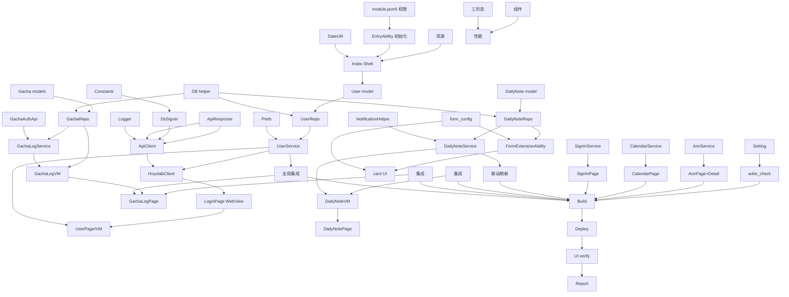

# Tasks: Snap.Hutao.HarmonyOS（胡桃工具箱鸿蒙版）

**Input**: Design documents from `spec/snap-hutao-harmonyos/`
**Prerequisites**: plan.md (required), spec.md (required for user stories)

**Organization**: Tasks are grouped by user story to enable independent implementation and testing of each story.

## Format: `[ID] [P?] [Story] Description`

- **[P]**: Can run in parallel (different files, no dependencies)
- **[Story]**: Which user story this task belongs to (e.g., US1, US2, US3)
- Include exact file paths in descriptions

## Path Conventions

- Single HAP module: `entry/src/main/ets/`（源码）、`entry/src/main/resources/`（资源）、`entry/src/main/module.json5`（配置）

---

## Phase 1: Setup（工程基建，无网络依赖）

**Purpose**: 初始化工程骨架、通用层、数据库/网络基础，保证空壳可编译可运行

- [X] T001 梳理并更新 `entry/src/main/module.json5`：添加 `ohos.permission.INTERNET` 权限；确认 main_pages 路由 profile 引用正确
- [X] T002 创建通用层 `entry/src/main/ets/common/Constants.ets`（app_version 常量、DS 盐值 X4/K2/LK2、x-rpc 头常量、已知返回码枚举如 ret=0/-100/10001/1034/-5003）
- [X] T003 [P] 创建 `entry/src/main/ets/common/Logger.ets`（hilog 封装，domain/tag 常量）
- [X] T004 [P] 创建 `entry/src/main/ets/common/DateUtil.ets`（时间戳格式化/倒计时/恢复时间 Diff→可读文本）
- [X] T005 创建统一 API 响应封装 `entry/src/main/ets/model/ApiResponse.ets`（retcode/message/data 解析 + 成功/失败判定 + 已知返回码映射）
- [X] T006 实现 DS 签名器 `entry/src/main/ets/data/network/DsSigner.ets`（@ohos.security.cryptoFramework MD5；Gen1/Gen2 签名；随机串生成；离线自测函数确保 ts=已知值输出 32 位小写 hex）
- [X] T007 实现网络客户端封装 `entry/src/main/ets/data/network/ApiClient.ets`（@ohos.net.http：GET/POST/JSON header/超时/Cookie 注入/retcode 解析/错误归一化）
- [X] T008 实现数据库封装 `entry/src/main/ets/data/db/RelationalStoreHelper.ets`（relationalStore 建库 `snap_hutao.db` + 全部表结构：user_accounts/user_game_roles/gacha_archives/gacha_items/daily_notes/sign_in_info/act_calendar_entries/announcements；对应 plan.md Data Model；版本升级预留）
- [X] T009 [P] 实现偏好存储 `entry/src/main/ets/data/prefs/PreferencesStore.ets`（preferences：current_user_id/current_uid/refresh_interval/auto_refresh/theme/通知阈值）
- [X] T010 改造入口 `entry/src/main/ets/entryability/EntryAbility.ets`：onWindowStageCreate 时初始化 DB/预登录态后 loadContent('pages/Index')
- [X] T011 改造 `entry/src/main/ets/pages/Index.ets` 为 Shell 导航壳：底部 Tabs（首页/祈愿/便笺/我的）+ Navigation/NavDestination 子页路由 + 深浅色跟随 + 空页面占位；`entry/src/main/resources/base/element/string.json` 补页面/标签字符串、color.json 补主题色、float.json 补字号
- [X] T012 补齐可视化资源 `entry/src/main/resources/base/media/`（应用图标/占位图/默认头像等）与 `entry/src/main/resources/base/profile/main_pages.json` 页面路由表

**Checkpoint**: 编译通过；空壳 Shell 可运行；DsSigner 离线自测通过；数据库表创建成功

---

## Phase 2: Foundational（用户与账号 —— US1 前置）

**Purpose**: US1 用户/账号管理是其余全部用户故事的前置（祈愿/便笺/签到/日历都依赖登录态与 UID），本阶段完成 US1 核心

### User Story 1 - 用户/账号管理（含 WebView 登录）（Priority: P1）🎯 MVP

**Goal**: 玩家内置 WebView 登录米游社，App 提取保存 Cookie 五件套，支持多账号切换与绑定角色 UID 选择；登录态持久化

**Independent Test**: WebView 真实登录成功；多账号可切换；默认 UID 选择保存；重启保持登录态

- [X] T013 [US1] 创建 `entry/src/main/ets/model/User.ets`（账号实体 + Cookie 五件套 + 解析/序列化）与 `entry/src/main/ets/model/UserGameRole.ets`
- [X] T014 [US1] 实现 `entry/src/main/ets/data/repo/UserRepo.ets`（user_accounts/user_game_roles 表 CRUD、当前账号/默认 UID 读写、Token 加密存储【@kit 本地加密】）
- [X] T015 [US1] 实现 `entry/src/main/ets/service/UserService.ets`：Cookie 字符串解析→建立 User；Token 链补齐（SToken→LToken→cookie_token，调用 passport `getCookieAccountInfoBySToken`/`getLTokenBySToken`）；多账号增删切换；全局 AppStorage 状态同步
- [X] T016 [US1] 实现 `entry/src/main/ets/data/network/HoyolabClient.ets`（按 host 注入 x-rpc-app_version/client_type/device_id/UA 与 Cookie；封装 `GET dailyNote/act_calendar`、`POST luna/sign`、`POST genAuthKey`、`POST getActionTicketBySToken`、`GET getUserGameRoles` 端点与参数构造）
- [X] T017 [US1] 实现 `entry/src/main/ets/pages/LoginPage.ets`：内置 Web 组件加载 `act.mihoyo.com` 登录落地页；登录后通过 WebCookieManager 读取 `.mihoyo.com`/`.miyoushe.com` 域名 Cookie 解析五件套；提供手动粘贴完整 Cookie 兜底输入与校验；登录成功回调 UserService
- [X] T018 [US1] 实现 `entry/src/main/ets/pages/UserPage.ets` + `entry/src/main/ets/viewmodel/UserViewModel.ets`：账号列表/添加/删除/切换；绑定游戏角色列表与默认 UID 选择；当前账号展示（昵称/头像）；未登录引导态
- [X] T019 [US1] 实现 `entry/src/main/ets/components/LoginStatusBar.ets`（全局登录状态展示：已登录显示昵称/头像，未登录显示"去登录"，点击导航到 LoginPage）
- [X] T020 [US1] 全局集成：AppStorage 注入 `currentUser/currentUid/isLoggedIn`；EntryAbility/Shell 启动时恢复登录态；`pages/SettingPage.ets` 加入"账号与数据"入口与"退出登录"
- [X] T021 [US1] 多态与安全：Token 密文存储；切换账号时全局清缓存态重绑；重复登录 upsert 同一账号

**Checkpoint**: US1 完整可用 —— 真实登录成功、多账号切换、UID 选择、登录态持久化；其余故事可依赖此登录态

---

## Phase 3: 用户故事 2 - 祈愿记录（Priority: P1）

**Goal**: SToken 自动 genAuthKey → 分页拉取祈愿历史 → 本地归档去重 → 分池统计/水位展示；手动 URL 兜底

**Independent Test**: 一键刷新拉到与游戏一致历史；重复刷新不重复；统计正确；手动 URL 可用

- [X] T022 [US2] 创建祈愿模型 `entry/src/main/ets/model/GachaType.ets`、`entry/src/main/ets/model/GachaItem.ets`、`entry/src/main/ets/model/GachaArchive.ets`（含 JSON→实体映射、gacha_type 枚举 100/200/301/302/500 与展示名映射）
- [X] T023 [US2] 实现 `entry/src/main/ets/data/repo/GachaRepo.ets`（gacha_archives/gacha_items CRUD：按 uid 归档、按 archive+queryType 取最新 id、批量插入、按类型范围删除、统计聚合查询）
- [X] T024 [US2] 实现 `entry/src/main/ets/data/network/GachaAuthApi.ets`（POST genAuthKey：DS Gen1/K2 + SToken Cookie；body {auth_appid:"webview_gacha",game_biz:"hk4e_cn",game_uid,region}；解析 authkey/authkey_ver/sign_type）
- [X] T025 [US2] 实现 `entry/src/main/ets/service/GachaLogService.ets`：刷新流程（genAuthKey→拼 query→逐 gacha_type 分页 size=20 end_id 游标→去重合并→按 Lazy/Aggressive 策略写入→进度上报）；手动 URL 兜底解析（校验 auth_appid/lang，TrimEnd #/log）；防封 1~2s 随机延时；authkey 超时检测
- [X] T026 [US2] 实现 `entry/src/main/ets/viewmodel/GachaLogViewModel.ets` + `entry/src/main/ets/model/GachaStatistics.ets`：从 GachaRepo 聚合生成统计（总抽数/各池/出金历史/水位垫数）、刷新进度状态、归档管理（删除/切换）
- [X] T027 [US2] 实现 `entry/src/main/ets/pages/GachaLogPage.ets`：分段容器（总览统计卡/分池数据/历史记录列表）；LazyForEach 长列表渲染 gacha_items；刷新按钮/进度弹层；手动 URL 输入对话框；未登录引导态
- [X] T028 [US2] 集成：祈愿页与 UserPage 登录态/默认 UID 联动；刷新前后端到端走通

**Checkpoint**: US2 完整可用 —— 真实账号一键刷新成功、去重正确、统计正确、手动 URL 可用

---

## Phase 4: 用户故事 3 - 实时便笺（Priority: P1）

**Goal**: dailyNote API 拉取并展示便笺全量数据；阈值本地通知；应用内定时刷新

**Independent Test**: 真实 UID 数据正确展示；达到阈值触发本地通知；定时刷新生效

- [X] T029 [US3] 创建 `entry/src/main/ets/model/DailyNote.ets`（DailyNote/Expedition/Transformer/DailyTask 数据类 + JSON 映射 + 格式化辅助如 FormattedResin/恢复时间）
- [X] T030 [US3] 实现 `entry/src/main/ets/data/repo/DailyNoteRepo.ets`（daily_notes 表 CRUD、阈值字段读写、按 user+uid 查询/upsert）
- [X] T031 [US3] 实现 `entry/src/main/ets/service/DailyNoteService.ets`：`dailyNote?role_id&server` 拉取（DS Gen2/X4 + Cookie account_id/cookie_token + x-rpc 头 + risk 1034 重试）；缓存刷新时间；阈值判定（树脂/派遣/每日/参变仪/洞天宝钱）；自动刷新定时器（interval from prefs）
- [X] T032 [US3] 实现 `entry/src/main/ets/data/local/NotificationHelper.ets`（@ohos.notificationManager：创建通知渠道、发布/取消本地通知、通知权限申请）
- [X] T033 [US3] 实现 `entry/src/main/ets/viewmodel/DailyNoteViewModel.ets`：数据状态、手动刷新命令、通知阈值设置、自动刷新开关、上次刷新时间
- [X] T034 [US3] 实现 `entry/src/main/ets/pages/DailyNotePage.ets`：树脂环形进度、派遣列表（图标/倒计时）、每日委托勾选、周本折扣、洞天宝钱、参变仪冷却、魔神任务进度；手动刷新 vs 自动刷新状态；未登录引导
- [X] T035 [US3] 集成：便笺页与默认 UID 联动；通知授权引导；设置页刷新间隔/通知开关写入 prefs 并实时生效

**Checkpoint**: US3 完整可用 —— 真实数据展示、阈值通知、定时刷新

---

## Phase 5: 用户故事 4 - 实时便笺桌面卡片（Priority: P2）

**Goal**: FormExtensionAbility 服务卡片展示树脂/派遣/每日摘要；定时刷新 + App 内刷新联动

**Independent Test**: 桌面添加卡片显示数据；App 手动刷新后卡片同步；定时刷新生效

- [X] T036 [US4] 编写卡片配置文件 `entry/src/main/resources/base/profile/form_config.json`（dimension 2x2/2x4、updateEnabled:true、scheduledUpdateTime、relatedBundle 等）+ 在 `entry/src/main/module.json5` 注册 `DailyNoteFormExtensionAbility`（type: form, srcEntry `./ets/widgets/DailyNoteFormExtensionAbility.ets`）
- [X] T037 [US4] 实现 `entry/src/main/ets/widgets/pages/DailyNoteCard.ets`（rootId `DailyNoteCard`；ArkTS 卡片：树脂环/派遣/每日摘要；无完整 Kit 依赖）
- [X] T038 [US4] 实现 `entry/src/main/ets/widgets/DailyNoteFormExtensionAbility.ets`（onAddForm/onUpdateForm/onFormEvent：读 DailyNoteRepo 最新快照→组装 formData→formBindingData 渲染；定时刷新逻辑）
- [X] T039 [US4] 联动：DailyNoteService 手动/自动刷新成功后调用 formProvider.updateForm 更新全部卡片；`resources/base/element/string.json` 补卡片标题

**Checkpoint**: US4 完整可用 —— 桌面卡片正确显示并联动刷新

---

## Phase 6: 用户故事 5 - 签到（Priority: P3）

**Goal**: Luna 每日签到 + 本月奖励列表/签到状态展示

**Independent Test**: 真实账号签到返回成功/已签；奖励列表展示

- [X] T040 [US5] 创建 `entry/src/main/ets/model/SignInInfo.ets` + 实现 `entry/src/main/ets/service/SignInService.ets`（`luna/sign` POST DS Gen1/LK2 + Cookie；`luna/home` 获取奖励与状态；返回码 -5003 已签等映射）
- [X] T041 [US5] 实现 `entry/src/main/ets/viewmodel/SignInViewModel.ets` + `entry/src/main/ets/pages/SignInPage.ets`（奖励日历/列表、本月累计天数、签到按钮、已签状态、未登录引导）

**Checkpoint**: US5 完整可用

---

## Phase 7: 用户故事 6 - 活动日历（Priority: P3）

**Goal**: act_calendar 活动/卡池/签到条目展示

**Independent Test**: 已登录拉取活动日历并线性展示

- [X] T042 [US6] 创建 `entry/src/main/ets/model/ActCalendarEntry.ets` + 实现 `entry/src/main/ets/service/CalendarService.ets`（`act_calendar?uid&region`，DS Gen2/X4 + Cookie）
- [X] T043 [US6] 实现 `entry/src/main/ets/viewmodel/CalendarViewModel.ets` + `entry/src/main/ets/pages/CalendarPage.ets`（按类型分组/按时间排序列表、起止时间、未登录引导）

**Checkpoint**: US6 完整可用

---

## Phase 8: 用户故事 7 - 公告（Priority: P3）

**Goal**: hk4e-ann 官方公告列表 + 详情（Web 查看）

**Independent Test**: 公告列表加载，点击显示详情

- [X] T044 [US7] 创建 `entry/src/main/ets/model/Announcement.ets` + 实现 `entry/src/main/ets/service/AnnouncementService.ets`（`hk4e-ann-api.../getAnnList` + `getAnnContent`，无需登录）
- [X] T045 [US7] 实现 `entry/src/main/ets/viewmodel/AnnouncementViewModel.ets` + `entry/src/main/ets/pages/AnnouncementPage.ets`（分类 tab + 列表）+ `entry/src/main/ets/pages/AnnouncementDetailPage.ets`（Web 组件加载公告内页）

**Checkpoint**: US7 完整可用

---

## Phase 9: Polish（跨故事打磨）

**Purpose**: 跨页面一致性、性能、三形态适配、深浅色、空/错/加载态

- [ ] T046 [P] 性能：祈愿历史/公告/日历长列表 LazyForEach + IDataSource 复核；网络/DS/统计聚合放入 TaskPool（Sendable DTO 传参）`entry/src/main/ets/`
- [ ] T047 [P] 三形态适配：phone 单列 / tablet / 2in1 双栏断点（MediaQuery/breakpoints）在 `entry/src/main/ets/pages/Index.ets` 与主要页；深/浅色资源复核
- [ ] T048 [P] 统一状态组件：空态 EmptyState、加载 Loading、错误 ErrorHint 组件放入 `entry/src/main/ets/components/` 并在各页复用
- [ ] T049 [P] 设置完善：`entry/src/main/ets/pages/SettingPage.ets`（刷新间隔/通知开关/主题/数据管理-清空祈愿/退出登录）
- [ ] T050 全量 `arkts_check` 修复（零阻塞性违规）+ 静态资源/字符串核查

**Checkpoint**: 全功能 UI 打磨完成，可进入验证

---

## Phase 10: Verification

<!-- verification_scope: build+ui -->

**Purpose**: 编译构建、部署到设备、UI 冒烟验证全链路

- [ ] T051 Build project and fix any compilation errors (invoke `build_project`; iterate fix → build until success)
- [ ] T052 Deploy application to device/emulator (invoke `start_app`)
- [ ] T053 Run UI verification against deployed application (invoke `verify_ui` —— 覆盖 Shell 导航可达各页面、登录引导态、设置页、深浅色切换；登录/祈愿/便笺真实接口验证视账号可用性）
- [ ] T054 汇总验证报告：各用户故事状态（PASS/FAIL）、构建产物、遗留问题

---

## 📊 Dependency Graph



## ⚡ Parallel Execution Guide

| Phase | Tasks | Required Files | Execution Notes |
|---|---|---|---|
| Setup | T003, T004 (P) | 不同 common/ 文件 | 可并行 |
| Setup | T009 (P) | data/prefs | 与 DB helper 并行 |
| US1 | T013, T016 (P) | model 与 network 不同文件 | 可并行 |
| US2 | T022, T024 (P) | model 与 network 不同文件 | 可并行 |
| US3 | T029, T032 (P) | model 与 notification 不同文件 | 可并行 |
| US4 | T036, T037, T038 | form_config 独立 | 037/038 依赖 036 注册 |
| US5-US7 | 相互独立 (P) | 各自 service/viewmodel/pages | 可并行（均依赖 US1 登录态与 DB） |
| Polish | T046, T047, T048, T049 (P) | 不同文件 | 可并行 |
| Verification | T051→T052→T053→T054 | 串行 | 依赖前序全部完成 |

## Implementation Strategy

### MVP First (User Story 1 Only)

1. 完成 Phase 1 Setup（T001-T012）→ 空壳可运行
2. 完成 Phase 2 US1 用户/账号（T013-T021）→ **MVP 可用**（登录+多账号+角色绑定）
3. 验证 US1 独立可用后进入后续故事

### Incremental Delivery

1. US1（登录）→ US2（祈愿）→ US3（便笺）→ US4（卡片）→ US5（签到）→ US6（日历）→ US7（公告）
2. 每个用户故事独立可测，交付可演示增量
3. 全程遵循：Models → Services → ViewModels → Pages → Integration 的顺序

### Parallel Team Strategy

- Team A: Setup（T001-T012）
- Team B（US1 完成后）: US3 实时便笺 与 US2 祈愿 可并行开发（网络层共享 ApiClient/DsSigner）
- Team C: US5/US6/US7 辅助功能可并行

## Dependencies & Execution Order

### Phase Dependencies

- **Setup (Phase 1)**: 无依赖，可立即启动；全部完成后空壳可编译
- **Foundational US1 (Phase 2)**: 依赖 Setup 完成；**阻塞** 其余所有用户故事（缺少登录态/UID 时祈愿/便笺/签到/日历均无数据源）
- **User Stories (Phases 3-8)**: 均依赖 US1 完成（登录态与默认 UID）；US2-US7 之间相互独立，可并行或按优先级顺序
- **Polish (Phase 9)**: 依赖所有用户故事完成
- **Verification (Phase 10)**: 依赖全部前序 Phase 完成，且严格串行 T051→T052→T053→T054

### User Story Dependencies

- **US1 (P1, Phase 2)**: 仅依赖 Setup —— 无其他故事依赖，最先实现（MVP）
- **US2 祈愿 (P1, Phase 3)**: 依赖 US1（登录+UID）；共享网络层（ApiClient/DsSigner）
- **US3 便笺 (P1, Phase 4)**: 依赖 US1（登录+UID）；US4 卡片依赖 US3 数据
- **US4 卡片 (P2, Phase 5)**: 依赖 US3（便笺数据 + 自动刷新）
- **US5 签到 / US6 日历 / US7 公告 (P3, Phases 6-8)**: 均依赖 US1（签到/日历需登录；公告无需登录但归入辅助）；三者互相独立

### Within Each User Story

- 顺序：Models → Repos/Services → ViewModels → Pages → Integration → 该故事 checkpoint 验证
- 每个故事在其 checkpoint 独立可测（见各 Phase 的 Independent Test）

### Parallel Opportunities

- Setup: T003/T004/T009 标 [P] 可并行
- US1 内部: T013/T016 标 [P] 可并行
- US2 内部: T022/T024 标 [P] 可并行
- US3 内部: T029/T032 标 [P] 可并行
- US4 内部: T037/T038 依赖 T036 注册，序列执行
- US5/US6/US7: 三者完全独立，可并行
- Polish: T046/T047/T048/T049 标 [P] 可并行
- Verification: 严格串行

## Parallel Example

```bash
# 并行启动 Setup 独立文件任务（同批）：
Task: "创建 common/Logger.ets（hilog 封装）"
Task: "创建 common/DateUtil.ets（时间戳/倒计时工具）"
Task: "实现 data/prefs/PreferencesStore.ets（preferences 存储）"

# US1 内部并行（model 与 network 不同文件）：
Task: "创建 model/User.ets 与 model/UserGameRole.ets"
Task: "实现 data/network/HoyolabClient.ets（x-rpc 头与端点封装）"

# US5/US6/US7 辅助功能并行：
Task: "实现 SignInService + SignInPage"
Task: "实现 CalendarService + CalendarPage"
Task: "实现 AnnouncementService + AnnouncementPage"
```

---

## 任务汇总（48 项）

| 阶段 | 起始任务 | 结束任务 | 数量 |
|---|---|---|---|
| Phase 1 Setup | T001 | T012 | 12 |
| Phase 2 US1 用户/账号 | T013 | T021 | 9 |
| Phase 3 US2 祈愿记录 | T022 | T028 | 7 |
| Phase 4 US3 实时便笺 | T029 | T035 | 7 |
| Phase 5 US4 桌面卡片 | T036 | T039 | 4 |
| Phase 6 US5 签到 | T040 | T041 | 2 |
| Phase 7 US6 活动日历 | T042 | T043 | 2 |
| Phase 8 US7 公告 | T044 | T045 | 2 |
| Phase 9 Polish | T046 | T050 | 5 |
| Phase 10 Verification | T051 | T054 | 4 |
| **合计** | — | — | **54** |

校验项：✅ 每个任务以 `- [ ]` 开头；✅ Task ID 唯一顺序（T001-T054）；✅ US 阶段带 `[USx]` 标签、Setup/Foundational/Polish/Verification 不带；✅ 总数为 54 与汇总一致。
